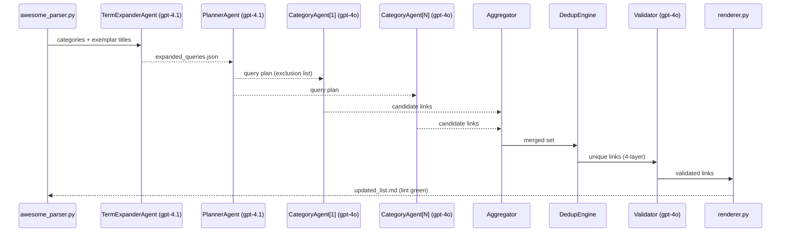

# Awesome-List Researcher

A Docker-first tool that discovers and adds new, unique links to GitHub awesome lists using OpenAI's agent system.

## Features

- Fetches raw README.md from any GitHub awesome-list repository (no GitHub API needed)
- Expands search terms automatically using OpenAI's Responses API
- Executes multi-agent research using OpenAI's Assistants API with search and browser tools
- Applies four-layer deduplication:
  1. Case-insensitive title comparison
  2. Levenshtein distance (threshold ≤ 2)
  3. Canonical URL matching
  4. Semantic embedding similarity (threshold ≥ 0.85)
- Validates all links with HTTP HEAD requests
- Ensures all descriptions are properly formatted (≤ 100 characters)
- Renders updated awesome-list that passes awesome-lint
- Generates detailed research report
- Enforces wall time and cost limits for predictable execution

## Installation

### Prerequisites

- Docker
- OpenAI API key with access to GPT-4.1 (for planner) and GPT-4o (for researcher and validator)

### Getting Started

1. Clone this repository:
   ```
   git clone https://github.com/yourusername/awesome-researcher.git
   cd awesome-researcher
   ```

2. Set your OpenAI API key:
   ```
   export OPENAI_API_KEY=your_api_key_here
   ```

3. Run the tool:
   ```
   ./build-and-run.sh --repo_url https://github.com/vinta/awesome-python
   ```

## Usage

The `build-and-run.sh` script handles building the Docker container and running the tool with the specified parameters.

### Basic Usage

```bash
./build-and-run.sh --repo_url https://github.com/username/awesome-repo
```

### Advanced Usage

```bash
./build-and-run.sh \
  --repo_url https://github.com/username/awesome-repo \
  --wall_time 1200 \
  --cost_ceiling 15 \
  --output_dir custom_runs \
  --seed 42 \
  --model_planner gpt-4.1 \
  --model_researcher gpt-4o \
--model_validator gpt-4o
```

### Command Line Arguments

| Argument | Description | Default |
|----------|-------------|---------|
| `--repo_url` | URL of the GitHub repository (required) | - |
| `--wall_time` | Maximum wall time in seconds | 600 |
| `--cost_ceiling` | Maximum cost in USD | 10.0 |
| `--output_dir` | Output directory | runs/ |
| `--seed` | Random seed for deterministic behavior | Random |
| `--model_planner` | Model to use for planner agent | gpt-4.1 |
| `--model_researcher` | Model to use for researcher agent | gpt-4o |
| `--model_validator` | Model to use for validator agent | gpt-4o |

The tool also requires the `OPENAI_API_KEY` environment variable to be set.

## Output

All outputs are stored in the `runs/<timestamp>/` directory. The following files are generated:

- `original.json` - Original parsed data
- `expanded_queries.json` - Expanded query terms
- `plan.json` - Research plan
- `candidate_*.json` - Candidate resources for each category
- `new_links.json` - Deduplicated new links
- `validated_links.json` - Validated links
- `updated_list.md` - Updated awesome list
- `agent.log` - Detailed log of the process
- `research_report.md` - Summary of the findings

## Architecture

The Awesome-List Researcher is built around a pipeline of specialized components:



See [architecture.md](architecture.md) for detailed design information.

## Deduplication Engine

The deduplication engine applies four layers of filtering to ensure that only truly unique resources are added to the awesome list:

1. **Case-Insensitive Title Matching**: Filters resources with identical titles (ignoring case).
2. **Levenshtein Distance**: Filters resources with very similar titles (edit distance ≤ 2).
3. **Canonical URL Matching**: Filters resources with the same domain and path.
4. **Semantic Similarity**: Filters resources with highly similar content (cosine similarity ≥ 0.85).

The engine also filters out any resources that already exist in the original list. If more than 30% of candidate resources are filtered out as duplicates, a warning is logged.

## Testing

To run the end-to-end test:

```bash
./tests/run_e2e.sh
```

The test script runs the tool with a default repository (awesome-python) and verifies that:

1. The tool completes successfully
2. All required output files are generated
3. At least 10 new links are discovered
4. The updated list passes awesome-lint
5. The new links are semantically unique

## Logging

Detailed logs are stored in the `agent.log` file within the output directory. The logs include:

- ISO 8601 timestamps and phase tracking
- Prompt and completion excerpts (first 200 chars)
- Token counts, latency (ms), and incremental cost
- Category context (category, query_idx, retry_idx)
- Validation flags (schema_valid, markdown_lint_pass, url_valid)

Example log entry:
```json
{"phase": "query", "category": "Codecs", "term_idx": 0, "retry_idx": 0, "query": "video compression formats", "prompt_excerpt": "You are a research assistant specializing in finding high-quality resources related to Codecs", "completion_excerpt": "Here are some high-quality resources related to video compression formats:", "latency_ms": 4263, "tokens": 1423, "cost_usd": 0.0284}
```

## License

[MIT](LICENSE)

## Contributing

Contributions are welcome! Please feel free to submit a Pull Request.

## Acknowledgements

- This project uses the [OpenAI API](https://platform.openai.com/) for natural language processing.
- Thanks to the awesome-list maintainers for curating high-quality resources.
