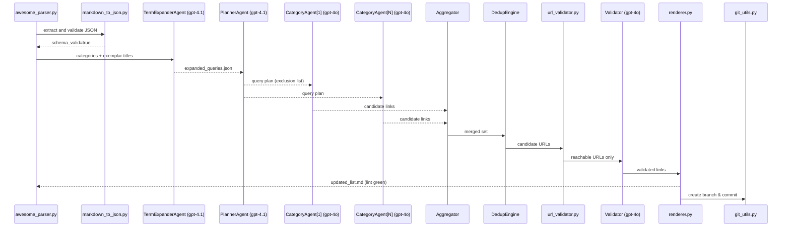

# Awesome-List Researcher Architecture

This document describes the architecture of the Awesome-List Researcher system. The system uses a multi-agent approach to discover new links for awesome lists, with a focus on quality, uniqueness, and relevance.

## System Architecture

The Awesome-List Researcher is built around a sequence of processing steps, each handled by specialized components. The system fetches raw markdown from GitHub repositories, parses it into structured data, extracts and validates against JSON schema, expands search terms, plans category-specific research strategies, executes the research using OpenAI's assistants, deduplicates the results, validates the links, renders the updated awesome list, and finally creates a Git branch and commits the changes.

### Agent Communication Flow

## Component Details

### 0. Git Utilities

- **Path:** `src/git_utils.py`
- **Responsibility:** Create branches and commit changes
- **Key Features:**
  - Automatic branch creation with timestamp-based naming
  - Commit all changes with standardized messages
  - Return commit SHA for logging

### 1. Awesome Parser

- **Path:** `src/awesome_parser.py`
- **Responsibility:** Fetch raw markdown, parse it into structured data, extract exemplar titles
- **Key Features:**
  - Raw GitHub URL fetching with fallback
  - Markdown parsing with regex
  - Bloom filter for quick URL existence checks
  - Awesome-lint validation

### 2. Markdown to JSON

- **Path:** `src/markdown_to_json.py`
- **Responsibility:** Convert awesome list markdown to structured JSON
- **Key Features:**
  - JSON schema validation
  - Extraction of titles, descriptions, and URLs
  - Support for various markdown formats

### 3. Term Expander Agent

- **Path:** `src/term_expander_agent.py`
- **Model:** gpt-4.1
- **Responsibility:** Expand category-specific queries using OpenAI's API
- **Key Features:**
  - Category-aware term expansion
  - Cost-aware operation with ceiling checks
  - Detailed logging of API interactions

### 4. Planner Agent

- **Path:** `src/planner_agent.py`
- **Model:** gpt-4.1
- **Responsibility:** Create research plans for each category
- **Key Features:**
  - Seed-based deterministic behavior
  - External taxonomy support for video categories
  - Synonym enrichment for better search results
  - Query refinement using OpenAI's API
  - Negative prompting with original URLs

### 5. Category Research Agent

- **Path:** `src/category_agent.py`
- **Model:** gpt-4o
- **Responsibility:** Research specific categories using OpenAI's Assistants API
- **Key Features:**
  - Asynchronous execution with asyncio.gather
  - Retry logic with exponential back-off
  - Search and browser tools
  - Resource-aware operation with wall time and cost checks
  - Structured result parsing

### 6. Deduplication Engine

- **Path:** `src/dedup_engine.py`
- **Responsibility:** Apply four layers of deduplication to candidate resources
- **Key Features:**
  - Layer 1: Case-insensitive title matching
  - Layer 2: Levenshtein distance (threshold ≤ 2, ≤ 1 for video)
  - Layer 3: Canonical URL and hostname + title matching
  - Layer 4: Semantic embedding similarity (threshold ≥ 0.85, ≥ 0.88 for video)

### 7. URL Validator

- **Path:** `src/url_validator.py`
- **Responsibility:** Validate URLs through HTTP HEAD requests
- **Key Features:**
  - Asynchronous validation with httpx
  - Timeout controls (2 seconds default)
  - Bulk validation for efficiency

### 8. Validator Agent

- **Path:** `src/validator.py`
- **Model:** gpt-4o
- **Responsibility:** Validate discovered resources and trim descriptions
- **Key Features:**
  - URL validation with HTTP HEAD requests
  - Description trimming to max 100 characters
  - HTTPS enforcement
  - GitHub stars check for video categories (≥ 100 stars)

### 9. Renderer

- **Path:** `src/renderer.py`
- **Responsibility:** Generate the updated awesome list markdown and research report
- **Key Features:**
  - Proper Awesome-list formatting
  - Alphabetical sorting (ignoring A/An/The)
  - Awesome-lint validation and auto-fixes

### 10. Enhanced Logger

- **Path:** `src/logger.py`
- **Responsibility:** Comprehensive logging with detailed metrics
- **Key Features:**
  - Phase tracking with start/end timestamps
  - Prompt/completion excerpts (first 200 chars)
  - Token counts, latency (ms), and incremental cost
  - Category context (category, query_idx, retry_idx)
  - Validation flags (schema_valid, markdown_lint_pass, url_valid)

### 11. Main Orchestrator

- **Path:** `src/main.py`
- **Responsibility:** Orchestrate the entire process and handle CLI arguments
- **Key Features:**
  - Wall time enforcement
  - Cost ceiling enforcement
  - Command-line interface with extended flags
  - Sequence Thinking MCP integration

## Utilities

- **Logger:** `src/utils/logger.py` - ISO 8601 timestamps, structured logging, full prompt/completion capturing
- **Cost Tracker:** `src/utils/cost_tracker.py` - Token counting, cost estimation, ceiling enforcement
- **Timer:** `src/utils/timer.py` - Wall time tracking, timeouts, signals

## Data Flow

1. Raw GitHub markdown is fetched and parsed into structured data
2. Markdown is converted to JSON and validated against schema
3. Category exemplars are extracted and expanded using the Responses API
4. A research plan is created for each category, enriched with synonyms from taxonomy
5. Category agents execute the research plan using search and browser tools
6. Results are deduplicated using the four-layer filtering system
7. URLs are validated to ensure they are reachable
8. Links are validated and descriptions are trimmed if necessary
9. The updated awesome list is rendered and validated with awesome-lint
10. Changes are committed to a new Git branch

## Runtime Artifacts

All runtime artifacts are stored in the `runs/<timestamp>/` directory:

- `original.json` - Original parsed data
- `awesome.json` - Structured JSON data
- `expanded_queries.json` - Expanded query terms
- `plan.json` - Research plan
- `candidate_*.json` - Candidate resources for each category
- `new_links.json` - Deduplicated new links
- `validated_links.json` - Validated links
- `updated_list.md` - Updated awesome list
- `agent.log` - Detailed log of the process
- `research_report.md` - Summary of the findings
- `dedup_stats.json` - Deduplication statistics

## CLI Arguments

- `--repo_url` (required) - URL of the GitHub repository
- `--wall_time` / `--time-limit` (default: 600) - Maximum wall time in seconds
- `--cost_ceiling` (default: 10.0) - Maximum cost in USD
- `--output_dir` (default: "runs") - Output directory
- `--seed` (optional) - Random seed for deterministic behavior
- `--model_planner` (default: "gpt-4.1") - Model to use for planner agent
- `--model_researcher` (default: "gpt-4o") - Model to use for researcher agent
- `--model_validator` (default: "gpt-4o") - Model to use for validator agent
- `--contents` (optional) - Path to taxonomy file (e.g., for video categories)
- `--min-results` (default: 10) - Minimum number of results required
- `--global-timeout` (optional) - Global timeout in seconds
- `--gen-awesome-list` (flag) - Generate a new awesome list from scratch
- `--update` (flag) - Update an existing awesome list
