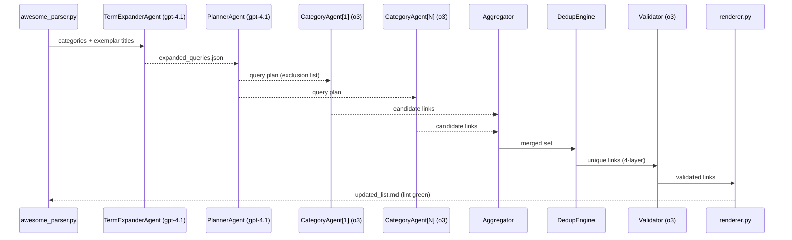

# Awesome-List Researcher Architecture

This document describes the architecture of the Awesome-List Researcher system. The system uses a multi-agent approach to discover new links for awesome lists, with a focus on quality, uniqueness, and relevance.

## System Architecture

The Awesome-List Researcher is built around a sequence of processing steps, each handled by specialized components. The system fetches raw markdown from GitHub repositories, parses it into structured data, expands search terms, plans category-specific research strategies, executes the research using OpenAI's assistants, deduplicates the results, validates the links, and finally renders the updated awesome list.

### Agent Communication Flow

## Component Details

### 1. Awesome Parser

- **Path:** `src/awesome_parser.py`
- **Responsibility:** Fetch raw markdown, parse it into structured data, extract exemplar titles
- **Key Features:**
  - Raw GitHub URL fetching with fallback
  - Markdown parsing with regex
  - Bloom filter for quick URL existence checks
  - Awesome-lint validation

### 2. Term Expander Agent

- **Path:** `src/term_expander_agent.py`
- **Model:** gpt-4.1
- **Responsibility:** Expand category-specific queries using OpenAI's API
- **Key Features:**
  - Category-aware term expansion
  - Cost-aware operation with ceiling checks
  - Detailed logging of API interactions

### 3. Planner Agent

- **Path:** `src/planner_agent.py`
- **Model:** gpt-4.1
- **Responsibility:** Create research plans for each category
- **Key Features:**
  - Seed-based deterministic behavior
  - Query refinement using OpenAI's API
  - Negative prompting with original URLs

### 4. Category Research Agent

- **Path:** `src/category_agent.py`
- **Model:** o3
- **Responsibility:** Research specific categories using OpenAI's Assistants API
- **Key Features:**
  - Search and browser tools
  - Resource-aware operation with wall time and cost checks
  - Structured result parsing

### 5. Deduplication Engine

- **Path:** `src/dedup_engine.py`
- **Responsibility:** Apply four layers of deduplication to candidate resources
- **Key Features:**
  - Layer 1: Case-insensitive title matching
  - Layer 2: Levenshtein distance (threshold ≤ 2)
  - Layer 3: Canonical URL matching
  - Layer 4: Semantic embedding similarity (threshold ≥ 0.85)

### 6. Validator Agent

- **Path:** `src/validator.py`
- **Model:** o3
- **Responsibility:** Validate discovered resources and trim descriptions
- **Key Features:**
  - URL validation with HTTP HEAD requests
  - Description trimming to max 100 characters
  - HTTPS enforcement

### 7. Renderer

- **Path:** `src/renderer.py`
- **Responsibility:** Generate the updated awesome list markdown and research report
- **Key Features:**
  - Proper Awesome-list formatting
  - Alphabetical sorting (ignoring A/An/The)
  - Awesome-lint validation and auto-fixes

### 8. Main Orchestrator

- **Path:** `src/main.py`
- **Responsibility:** Orchestrate the entire process and handle CLI arguments
- **Key Features:**
  - Wall time enforcement
  - Cost ceiling enforcement
  - Command-line interface

## Utilities

- **Logger:** `src/utils/logger.py` - ISO 8601 timestamps, structured logging, full prompt/completion capturing
- **Cost Tracker:** `src/utils/cost_tracker.py` - Token counting, cost estimation, ceiling enforcement
- **Timer:** `src/utils/timer.py` - Wall time tracking, timeouts, signals

## Data Flow

1. Raw GitHub markdown is fetched and parsed into structured data
2. Category exemplars are extracted and expanded using the Responses API
3. A research plan is created for each category
4. Category agents execute the research plan using search and browser tools
5. Results are deduplicated using the four-layer filtering system
6. Links are validated and descriptions are trimmed if necessary
7. The updated awesome list is rendered and validated with awesome-lint

## Runtime Artifacts

All runtime artifacts are stored in the `runs/<timestamp>/` directory:

- `original.json` - Original parsed data
- `expanded_queries.json` - Expanded query terms
- `plan.json` - Research plan
- `candidate_*.json` - Candidate resources for each category
- `new_links.json` - Deduplicated new links
- `validated_links.json` - Validated links
- `updated_list.md` - Updated awesome list
- `agent.log` - Detailed log of the process
- `research_report.md` - Summary of the findings

## CLI Arguments

- `--repo_url` (required) - URL of the GitHub repository
- `--wall_time` (default: 600) - Maximum wall time in seconds
- `--cost_ceiling` (default: 10.0) - Maximum cost in USD
- `--output_dir` (default: "runs") - Output directory
- `--seed` (optional) - Random seed for deterministic behavior
- `--model_planner` (default: "gpt-4.1") - Model to use for planner agent
- `--model_researcher` (default: "o3") - Model to use for researcher agent
- `--model_validator` (default: "o3") - Model to use for validator agent
